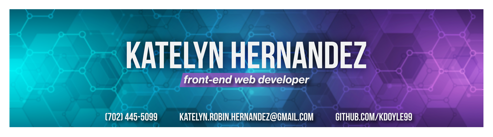

# Hi there, I’m Katelyn! 👋
Detail-oriented front-end web development student graduating in June with a strong foundation in responsive web design. Dedicated to creating intuitive user experiences through thoughtful design implementation and continuous skill growth.

## 👩‍💻 Languages I Know

## ⚙️ Tools I Use

## 🤝 Let's Connect
 

## 📁 Check Out My Other Work
<ul>
  <li><a href="https://codepen.io/kdoyle99">Codepen</a></li>
  <li></li>
</ul>

